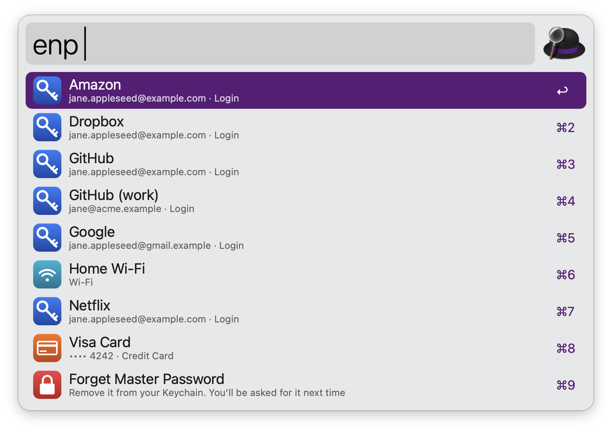
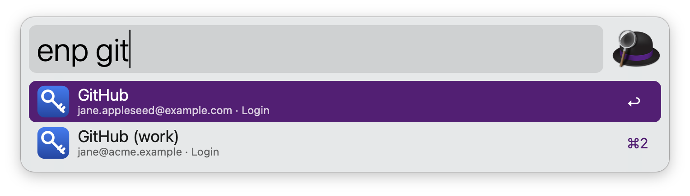
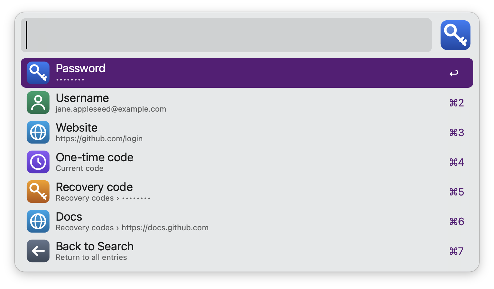

# Enpass for Alfred

Search your [Enpass](https://www.enpass.io) password vault from [Alfred](https://www.alfredapp.com) and copy passwords, usernames, one-time codes and any other field — without opening Enpass.



## Requirements

* [Alfred 5](https://www.alfredapp.com) with the [Powerpack](https://www.alfredapp.com/powerpack/)
* Enpass 6 on the same Mac
* [enpass-cli](https://github.com/hazcod/enpass-cli), which reads the vault: `brew install enpass-cli`

## Install

Download **Enpass.alfredworkflow** from the [latest release](https://github.com/x-o-r-r-o/alfred-enpass/releases/latest) and open it. If your vault uses a keyfile, choose it in the configuration window.

## Usage

Search your Enpass vault via the `enp` keyword. Type to filter by title, username, category or website.



* <kbd>↩</kbd> Copy password (or paste it, as set in the Workflow’s Configuration).
* <kbd>fn</kbd><kbd>↩</kbd> Do the opposite: paste instead of copy, or copy instead of paste.
* <kbd>⌘</kbd><kbd>↩</kbd> Copy username.
* <kbd>⌥</kbd><kbd>↩</kbd> Copy one-time code.
* <kbd>⌃</kbd><kbd>↩</kbd> Open website.
* <kbd>⇧</kbd><kbd>↩</kbd> Show all fields of the entry.
* <kbd>⌘</kbd><kbd>Y</kbd> Quick Look website.



In the fields list, <kbd>↩</kbd> copies a field, <kbd>⌘</kbd><kbd>↩</kbd> pastes it and <kbd>⌃</kbd><kbd>↩</kbd> opens a website field. Type `lock` to forget the saved master password.

Alternatively, search Enpass for selected text or a website’s domain via the Universal Action.

Configure the Hotkey to open the search directly.

The first search asks for your master password. It is checked against the vault and saved in your macOS Keychain.

## Configuration

| Option | Default | |
|---|---|---|
| Keyword | `enp` | |
| Vault Folder | `~/Library/Containers/in.sinew.Enpass-Desktop/Data/Documents/Vaults/primary` | In Enpass: Settings → Advanced → Data Location |
| Keyfile | — | Only for vaults protected with a keyfile |
| Action | Copy | Copy or paste on <kbd>↩</kbd> |
| Clear Clipboard | 30 seconds | 10–90 seconds or never |
| Trash | Off | Include entries in the Enpass trash |
| enpass-cli Path | auto | Found in `/opt/homebrew/bin` or `/usr/local/bin` |

To use more than one vault, duplicate the workflow in Alfred and point each copy at a different vault folder with its own keyword.

## Security

* **Read-only.** The vault is read by [enpass-cli](https://github.com/hazcod/enpass-cli) and never modified. Nothing is sent over the network.
* **Master password** is kept in your login Keychain (service `com.x-o-r-r-o.alfred.enpass`, shown as “Enpass for Alfred” in Keychain Access). It reaches enpass-cli only through its environment, never its command line. Type `lock` in the search to remove it.
* **Search results never contain secrets.** Passwords and codes are read only when you pick an action, and go straight to the clipboard without passing through Alfred.
* **Clipboard.** Copied values are marked as concealed and transient ([nspasteboard.org](http://nspasteboard.org)), so Alfred’s Clipboard History and other clipboard managers skip them. The clipboard is cleared after the configured delay — unless you copied something else in the meantime.
* While enpass-cli runs (well under a second), the master password is in its environment, which other programs running as your user could read. enpass-cli has no other way to receive it without a prompt.
* The Keychain item is created with Apple’s `security` tool, so while your login keychain is unlocked, any program running as your user can read it through that tool without a prompt. This is the same trust model as other password-manager workflows; don’t use it on a Mac you share an account on.
* Copied values stay on this Mac: they’re kept off Universal Clipboard. Only `http` and `https` websites are opened, and logins inside website addresses are never displayed.
* Notifications never name the entry, and only the entries that match are decrypted — never the whole vault.

## Limitations

* Entries whose title and username consist only of accented or other non-English capital-case letters (e.g. “ÄÖÜ”) can’t be copied from Alfred, because enpass-cli can’t search for them without decrypting the whole vault.
* Entries with no fields at all (for example a secure note with only note text) aren’t listed; enpass-cli skips them.
* Archived entries are listed like any other.
* Relies on enpass-cli following changes to the Enpass vault format.
* One-time codes use the standard 30-second period.

## Development

```
python3 tools/build.py            # generate workflow/info.plist and dist/Enpass.alfredworkflow
python3 tools/build.py --install  # also update the installed copy, keeping its configuration
test/run.sh                       # end-to-end tests against the demo vaults in test/fixtures
swift tools/make_icons.swift      # redraw the icons
tools/make_fixture.sh             # rebuild the demo vaults (needs sqlcipher)
tools/demo/make_demo_vault.sh     # rebuild the demo vault used for screenshots
tools/demo/shoot.sh               # capture README screenshots with the demo vault
```

The test and demo vaults use the master password `absolutely-No-clue` and are based on the sample vault from enpass-cli (MIT).

## Credits

* [enpass-cli](https://github.com/hazcod/enpass-cli) by hazcod and contributors, which does the vault decryption.
* Built with the help of an AI assistant (Claude).

Not affiliated with or endorsed by Enpass Technologies. Enpass is a trademark of its respective owner.

## License

[MIT](LICENSE)
